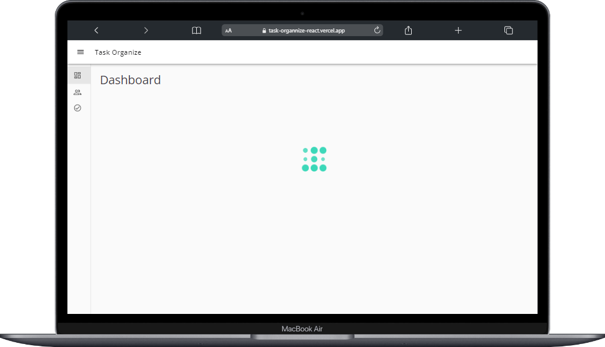
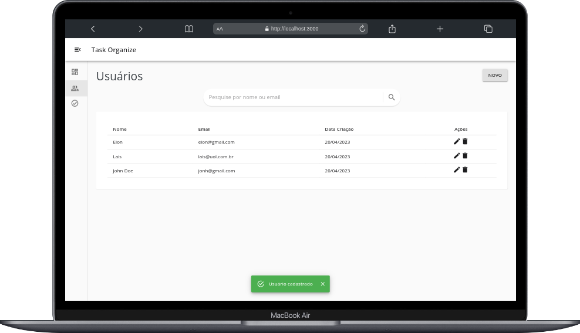

<h1 align="center">
   Task organize
</h1>

  <a href="#tecnologias">Tecnologias</a>&nbsp;&nbsp;&nbsp;|&nbsp;&nbsp; 
  <a href="#Deploy">Deploy</a>&nbsp;&nbsp;&nbsp;|&nbsp;&nbsp;&nbsp;
  <a href="#memo-licença">Licença</a>

   
   

 

### Repositório do [Curso Frontend React](https://www.youtube.com/watch?v=bxdLk93idaQ&list=PLl4e5NAFzX70Eo0hshlHzmrYi9IG0bYxq) disponível gratuitamente no YouTube:
 
<h1 align="center" >DashBoard</h1>

  

<h1 align="center" >Usuários</h1>
 

  

<h2 id="deploy">
  💻 Deploy 
</h2>

Você pode visualizar o projeto através [desse link](https://task-organnize-react.vercel.app/)

<h2 id="tecnologias">
 🚀 Stack Ultilizada
</h2>
Esse projeto foi desenvolvido com as seguintes tecnologias:

**Front-end:**
 - [React Js](https://react.dev/)
 - [Redux](https://redux.js.org/)
 - [Redux toolkit](https://redux-toolkit.js.org/)
 - [Material UI ](https://v4.mui.com/getting-started/installation/)
 - [Formik](https://formik.org/)
 - [Yup Validation ](https://github.com/jquense/yup)

**Back-end:**

 - [Node Js](https://nodejs.com/)
 - [Express](https://express.js/)
 - [MONGO DB](https://mongodb.com/)

<h2 id="Aprendizados">
  Aprendizados
</h2>

- Organização e estrutura de pasta em projeto React. 
- API de Internacionalização intl do ECMAScript.  Para formatação de números, data e hora.
- React custom hooks, como o useDebounce e useEscapeKey.
- Uso Mareial UI e da lib lotties.
- Validação de complexa de formulário ultizando o Formik
- Boas práticas de desenvolvimento web.
- Requisição HTTP com axios à endpoints Rest API

## :memo: Licença
Esse projeto está sob a licença MIT. Veja o arquivo [LICENSE](LICENSE.md) para mais detalhes.